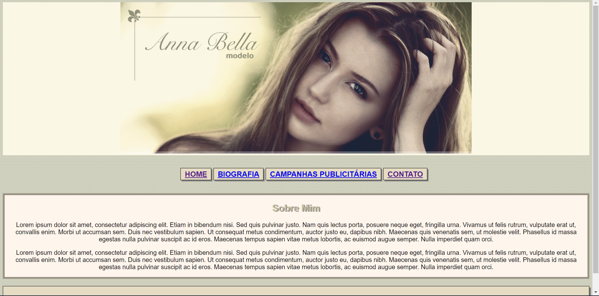

# Anna Bella Blog

Segundo projeto do Curso Desenvolvimento Web Completo 2021 da Udemy. 
Projeto feito usando apenas HTML 5 e CSS 3.

Trata-se do meu segundo código do curso, neste código implementamos o CSS ao HTML. 

<a href="https://anna-bella-krpt76sve-eduardzs.vercel.app/">Link do Projeto</a>

